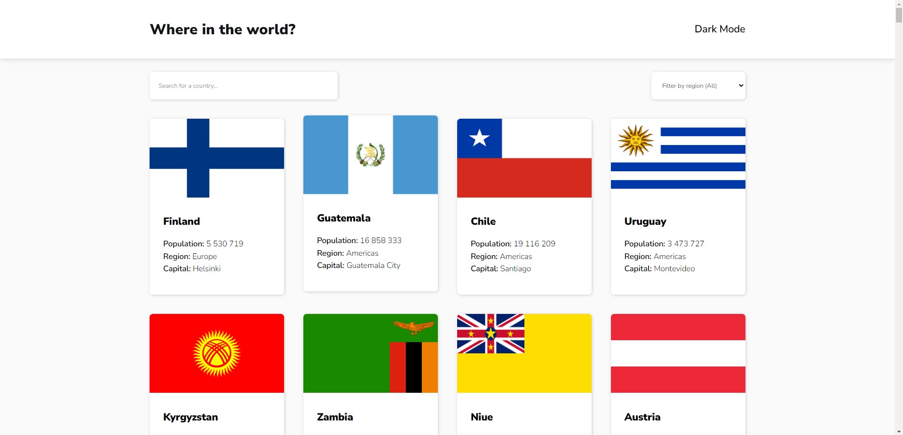
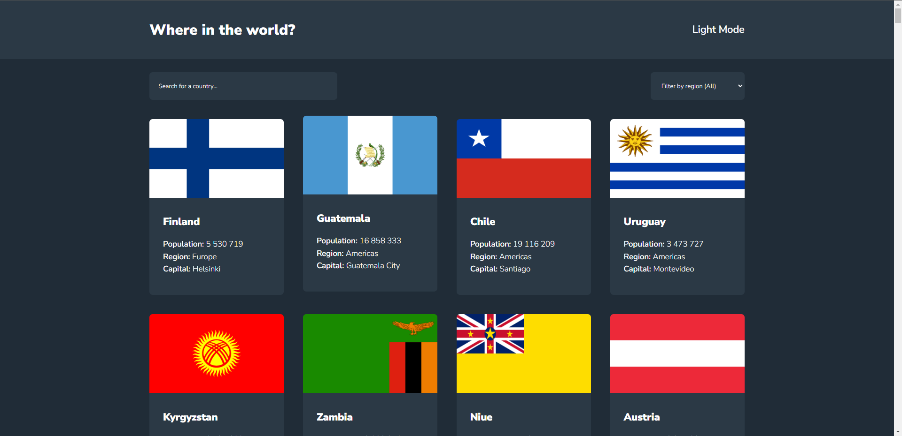
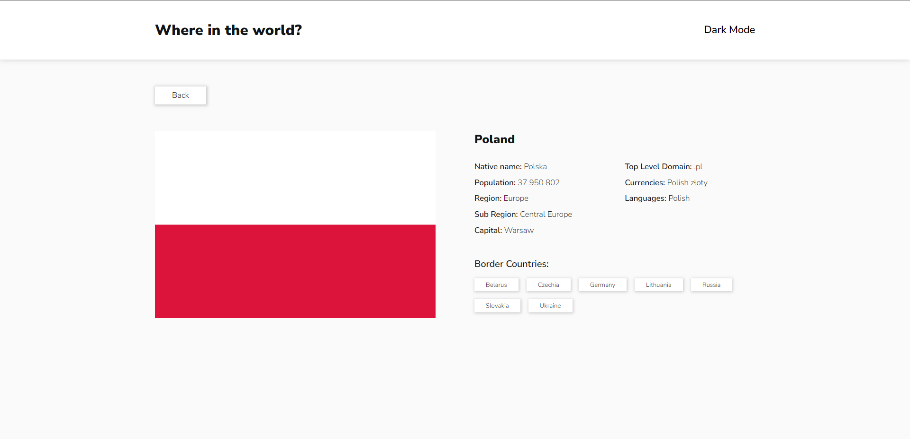
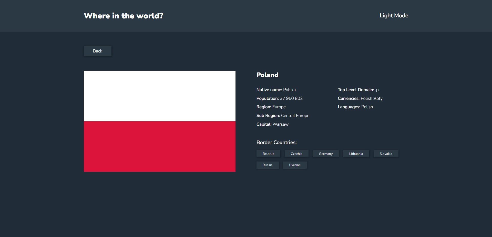
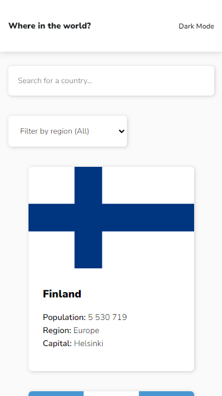
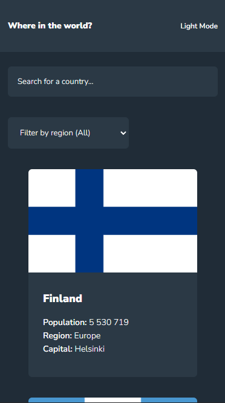
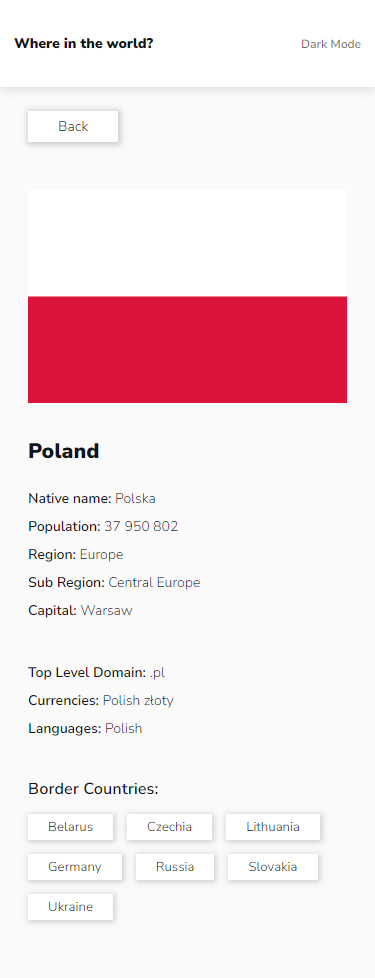
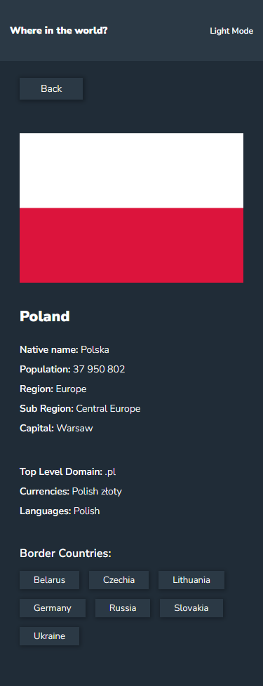

# Frontend Mentor - REST Countries API with color theme switcher solution

This is a solution to the [REST Countries API with color theme switcher challenge on Frontend Mentor](https://www.frontendmentor.io/challenges/rest-countries-api-with-color-theme-switcher-5cacc469fec04111f7b848ca). Frontend Mentor challenges help you improve your coding skills by building realistic projects. 

## Table of contents

- [Overview](#overview)
  - [The challenge](#the-challenge)
  - [Screenshot](#screenshot)
  - [Links](#links)
- [My process](#my-process)
  - [Plan](#plan)
  - [Time to complete](#time-to-complete)
  - [Built with](#built-with)
  - [What I learned](#what-i-learned)
  - [Useful resources](#useful-resources)
- [Author](#author)
- [Acknowledgments](#acknowledgments)

## Overview

This is a solution to the [REST Countries API with color theme switcher challenge on Frontend Mentor](https://www.frontendmentor.io/challenges/rest-countries-api-with-color-theme-switcher-5cacc469fec04111f7b848ca).
[REST Countries API documentation](https://restcountries.com/).

### The challenge

Users should be able to:

- See all countries from the API on the homepage
- Search for a country (by name) using an `input` field
- Filter countries by region (select element)
- Click on a country to see more detailed information 
- Click through to the border countries on the detail page
- Toggle the color scheme between light and dark mode

### Screenshot

### Links

- Solution: [GitHub respository](https://github.com/PawelGargula/rest-countries-api)
- Live: [GitHub pages](https://pawelgargula.github.io/rest-countries-api/)

## My process

### Plan

- Read REST COUNTRIES API documentation
- Add HTML template - home page
- Style elements for mobile - home page
- Style elements for desktop - home page
- JS - Add - load all countries
- JS - Add - searchings for countries 
- Add dark mode - home page
- Add HTML template - details page
- Style elements for mobile - details page
- Style elements for desktop - details page
- JS - Add - load country details
- Add dark mode - details page
- Refactor and manual tests
- Create custom readme file 

### Time to complete
Legend: 1 pomodoro is about 30 min (25 min + short break)

- Prediction: 85 pomodoro (42.5 hours / about 7 working days in full time job)
- Reality: I made it in 47 pomodoro (about 22 hours)

Made it faster that i thought.

### Built with

- Semantic HTML5 markup
- CSS custom properties
- Flexbox
- CSS Grid
- Mobile-first workflow
- Java script
- REST COUNTRIES API

### What I learned

- Train how to fectch data from API
- Generate HTML content dynamicly with javascript (create simple SPA)

### Useful resources

- [Test API](https://reqbin.com/)
- [REST Countries API docs](https://restcountries.com/)

## Author

- Frontend Mentor - [@PawelGargula](https://www.frontendmentor.io/profile/PawelGargula)
- Github - [@PawelGargula](https://github.com/PawelGargula)